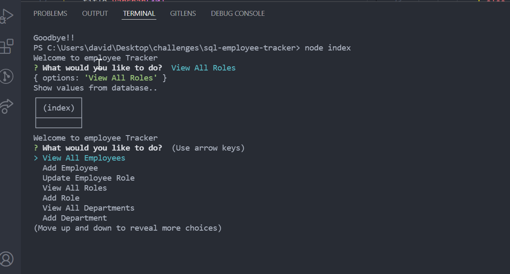

## Description
- I created this so employers can have a command line application to keep track of various data from their workforce. 
## Table of Contents
- [Installation](#installation)
- [Usage](#usage)
- [Credits](#credits)
- [License](#license)
## Installation
First, fork the repository to your local machine. Install dependencies with `npm install`. If you want to run the app without Docker you must also install MySQL and create a `.env` file containing `DB_USER`, `DB_PASSWORD`, and `DB_NAME`.

## Docker
1. Install [Docker](https://docs.docker.com/get-docker/) on your machine.
2. In the project root run `docker-compose up --build`.
   This builds the Node.js image, starts MySQL 8, seeds the database using the SQL files in the `db/` folder and launches the CLI.
3. When finished press `Ctrl+C` to stop the containers. To remove them run `docker-compose down`.
Use arrows keys to scroll through the various categories of "View All Employees", "Add Employee", "Update Employee Role", "View All Roles", "Add Role", "View All Departments", "Add Department", or "Quit". Then, press enter to perform the given action. 



## Credits
[David Griffin](https://github.com/DavidTJGriffin)
## License
MIT License

Copyright © 2021 David Griffin

Permission is hereby granted, free of charge, to any person obtaining a copy
of this software and associated documentation files (the "Software"), to deal
in the Software without restriction, including without limitation the rights
to use, copy, modify, merge, publish, distribute, sublicense, and/or sell
copies of the Software, and to permit persons to whom the Software is
furnished to do so, subject to the following conditions:

The above copyright notice and this permission notice shall be included in all
copies or substantial portions of the Software.

THE SOFTWARE IS PROVIDED "AS IS", WITHOUT WARRANTY OF ANY KIND, EXPRESS OR
IMPLIED, INCLUDING BUT NOT LIMITED TO THE WARRANTIES OF MERCHANTABILITY,
FITNESS FOR A PARTICULAR PURPOSE AND NONINFRINGEMENT. IN NO EVENT SHALL THE
AUTHORS OR COPYRIGHT HOLDERS BE LIABLE FOR ANY CLAIM, DAMAGES OR OTHER
LIABILITY, WHETHER IN AN ACTION OF CONTRACT, TORT OR OTHERWISE, ARISING FROM,
OUT OF OR IN CONNECTION WITH THE SOFTWARE OR THE USE OR OTHER DEALINGS IN THE
SOFTWARE.


## Features
- Easy command line interface
- Ability to add new data
- Ability to view existing data
## How to Contribute
1. Fork the project to your own machine
2. Refactor code to be further optimized 
3. Commit changes to your own branch
4. Push your work back up to your branch
5. Submit a Pull request so that I can review your changes
## Tests
With Docker running you can verify the connection by executing:

```
docker-compose run --rm app npm run test:connection
```
This runs `testConnection.js` which prints the result of a simple query to confirm the CLI can reach the MySQL container.